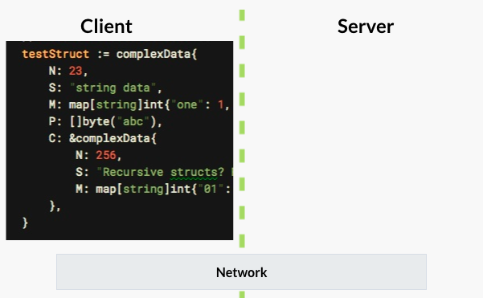

# Socket

Socket是网络编程的一个抽象概念，通常我们用一个 Socket 表示 “打开了一个网络连接”，在 Go 中主要使用 [net](https://golang.org/pkg/net/) 包。

使用 [net](https://golang.org/pkg/net/) 的 `func Dial(network, address string) (Conn, error)` 函数就可轻松建立一个 Socket 连接。Socket 创建成功后，我们可以对其进行 I/O 操作，最后不要记得对其进行关闭操作。

本章将从 TCP， UDP， Unix 入手，带领大家全面了解 Socket 在 Go 中的应用。

### 基本知识

Socket 连接又分为客户端和服务端，如图：



核心步骤包括：

- 创建连接:

```go
Dial(network, address string) (Conn, error)
```
注意, 这里的 network 可以为:

```golang
"tcp", "tcp4", "tcp6"
"udp", "udp4", "udp6"
"ip", "ip4", "ip6"
"unix", "unixgram", "unixpacket"
```

- 通过连接发送数据:

```
conn.Write([]byte("GET / HTTP/1.0\r\n\r\n"))
```

- 通过连接读取数据：

```
buf := make([]byte, 256)
conn.Read(buf)
```

- 关闭连接：

```
conn.Close()
```

>> 注意： `conn` 是一个 IO 对象，我们主要使用 IO 相关的帮助方法来进行读写操作。

### 实际例子之 google 首页访问

```golang
package main

import (
	"fmt"
	"io/ioutil"
	"log"
	"net"
)

func main() {
	// 尝试与 google.com:80 建立 tcp 连接
	conn, err := net.Dial("tcp", "google.com:80")
	if err != nil {
		log.Fatal(err)
	}

	defer conn.Close() // 退出关闭连接

	// 通过连接发送 GET 请求，访问首页
	_, err = fmt.Fprintf(conn, "GET / HTTP/1.0\r\n\r\n")
	if err != nil {
		log.Fatal(err)
	}

	dat, err := ioutil.ReadAll(conn)
	if err != nil {
		log.Fatal(err)
	}

	fmt.Println(string(dat))
}
```

当运行代码，可以得到 `google.com` 的首页内容，如下：

```
HTTP/1.0 200 OK
Date: Tue, 05 Jun 2018 14:45:30 GMT
Expires: -1
Cache-Control: private, max-age=0
Content-Type: text/html; charset=ISO-8859-1
P3P: CP="This is not a P3P policy! See g.co/p3phelp for more info."
Server: gws
X-XSS-Protection: 1; mode=block
X-Frame-Options: SAMEORIGIN
Set-Cookie: 1P_JAR=2018-06-05-14; expires=Thu, 05-Jul-2018 14:45:30 GMT; path=/; domain=.google.com
Set-Cookie: NID=131=mqkJocXSsDCD6zdcMyc12DCUqt3X19HIoS0HGTsAzsiuvFx56rBsliga5Uj22QyA8p2IZ6E7lkMGzchqam0RQ58PT6WV5Csllv80MO0uauY9P-FvzCLdYYY9tT0KYtVv; expires=Wed, 05-Dec-2018 14:45:30 GMT; path=/; domain=.google.com; HttpOnly
Accept-Ranges: none
Vary: Accept-Encoding
....
```

说明：google.com 网站后端是一个 HTTP server, 因为 HTTP 建立在 TCP 协议基础上，所以我们这里可以使用 TCP 协议来进行访问。

### TCP 操作

在这个例子中，我们先使用 net 包创建一个 TCP Server ，然后尝试连接 Server, 最后再通过客户端发送 `hello` 到 Server，同时 Server 响应 `word`。

我们来看完整例子：

- server/main.go

```golang
package main

import (
	"bufio"
	"fmt"
	"log"
	"net"
)

func main() {
	l, err := net.Listen("tcp", "127.0.0.1:8888")
	if err != nil {
		log.Fatal(err)
	}
	log.Printf("Start server with: %s", l.Addr())

	defer l.Close()

	for {
		conn, err := l.Accept()
		if err != nil {
			log.Fatal(err)
		}

		go handleConnection(conn)
	}
}

func handleConnection(conn net.Conn) {
	reader := bufio.NewReader(conn)

	for {
		dat, _, err := reader.ReadLine()
		if err != nil {
			log.Println(err)
			return
		}

		fmt.Println("client:", string(dat))

		_, err = conn.Write([]byte("word\n"))
		if err != nil {
			log.Println(err)
			return
		}
	}
}
```

注意： 
	1. 通过 `net.Listen("tcp", "127.0.0.1:8888")` 新建一个 TCP Server。
	2. 通过 `l.Accept()` 获取创建的连接。
	3. 通过 `go handleConnection(c)` 新建的 goroutine 来处理连接。

- client/main.go

```golang

package main

import (
	"bufio"
	"fmt"
	"log"
	"net"
	"time"
)

func main() {
	conn, err := net.Dial("tcp", "127.0.0.1:8888")
	if err != nil {
		log.Fatal(err)
	}

	defer conn.Close()

	reader := bufio.NewReader(conn)
	for {
		_, err := conn.Write([]byte("hello\n"))
		if err != nil {
			log.Fatal(err)
		}

		dat, _, err := reader.ReadLine()
		if err != nil {
			log.Fatal(err)
		}
		fmt.Println("sever:", string(dat))

		time.Sleep(5 * time.Second)
	}
}
```

注意： 
	1. 通过 `net.DialTCP("tcp", nil, addr)` 尝试创建到 TCP Sever 的连接。
	2. 通过 `conn.Write([]byte("hello\n"))` 向服务端发送数据。
	3. 通过 `reader.ReadLine()` 读取服务端响应数据。

当我们运行代码的时候，可以在终端看到如下输入：

```
go run server/main.go

2018/06/08 08:12:23 Start server with: 127.0.0.1:8888
client: hello
client: hello
```

```
go run client/main.go

2018/06/08 08:12:23 Start server with: 127.0.0.1:8888
sever: word
sever: word
```

### UDP 操作

UDP 相较于 TCP 简单的多，它具有以下特点：

- 无连接的
- 要求系统资源较少 
- UDP 程序结构较简单 
- 基于数据报模式(UDP)
- UDP 可能丢包 
- UDP 不保证数据顺序性 

下面我们通过一个统计服务在线人数的例子来了解它：

- server/main.go

```golang
package main

import (
	"log"
	"net"
	"time"
)

func main() {
	// listen to incoming udp packets
	pc, err := net.ListenPacket("udp", "127.0.0.1:8888")
	if err != nil {
		log.Fatal(err)
	}

	log.Printf("Start server with: %s", pc.LocalAddr())

	defer pc.Close()

	clients := make([]net.Addr, 0)

	go func() {
		for {
			for _, addr := range clients {
				_, err := pc.WriteTo([]byte("pong\n"), addr)
				if err != nil {
					log.Println(err)
				}
			}

			time.Sleep(5 * time.Second)
		}
	}()

	for {
		buf := make([]byte, 256)
		n, addr, err := pc.ReadFrom(buf)
		if err != nil {
			log.Println(err)
			continue
		}

		clients = append(clients, addr)

		log.Println(string(buf[0:n]))
		log.Println(addr.String(), "connecting...", len(clients), "connected")
	}
}
```

注意：
	1. 监听本地 UDP `127.0.0.1:8888`。
	2. 使用 `pc.ReadFrom(buf)` 方法读取客户端发送的消息。
	3. 使用 `clients` 来保存所有连上的客户端连接。
	4. 通过 `pc.WriteTo([]byte("pong\n"), addr)` 向所有客户端发送消息。

- client/main.go

```golang
package main

import (
	"bufio"
	"log"
	"net"
)

func main() {
	conn, err := net.Dial("udp", "127.0.0.1:8888")
	if err != nil {
		log.Fatal(err)
	}

	defer conn.Close()

	_, err = conn.Write([]byte("ping..."))
	if err != nil {
		log.Fatal(err)
	}

	reader := bufio.NewReader(conn)
	for {
		dat, _, err := reader.ReadLine()
		if err != nil {
			log.Fatal(err)
		}

		log.Println(string(dat))
	}
}
```

当我运行代码可以得到如下输出：

```
# 执行命令
go run server/main.go

# 输出
2018/06/08 14:36:13 Start server with: 127.0.0.1:8888
2018/06/08 14:36:15 ping...
2018/06/08 14:36:15 127.0.0.1:61790 connecting... 1 connected
2018/06/08 14:36:18 ping...
2018/06/08 14:36:18 127.0.0.1:59989 connecting... 2 connected
```

```
# 启动 client1
go run client/main.go

# 输出
2018/06/08 14:36:18 pong
2018/06/08 14:36:23 pong
```

```
# 启动 client2
go run client/main.go

# 输出
2018/06/08 14:37:58 pong
2018/06/08 14:38:03 pong
```

### Unix 操作

Unix 和 TCP 很相似，只不过监听的地址是一个 Socket 文件，例如：

```golang
l, err := net.Listen("unix", "/tmp/echo.sock")
```

下面我们就通过一个实际的例子来练习：

- server/main.go

```golang
package main

import (
	"log"
	"net"
)

func main() {
	l, err := net.Listen("unix", "/tmp/unix.sock")
	if err != nil {
		log.Fatal("listen error:", err)
	}

	for {
		conn, err := l.Accept()
		if err != nil {
			log.Fatal("accept error:", err)
		}

		go helloServer(conn)
	}
}

func helloServer(c net.Conn) {
	for {
		buf := make([]byte, 512)
		nr, err := c.Read(buf)
		if err != nil {
			return
		}

		data := buf[0:nr]
		log.Println(string(data))

		_, err = c.Write([]byte("hello"))
		if err != nil {
			log.Fatal("Write: ", err)
		}
	}
}
```

说明： 
	- 使用 `net.Listen("unix", "/tmp/unix.sock")` 启动一个 Server。
	- 使用 `conn, err := l.Accept()` 来接受客户端的连接。
	- 使用 `go helloServer(conn)` 来处理客户端连接，并读取客户端发送的数据 `hi` 并返回 `hello`。

- client/main.go

```golang
package main

import (
	"io"
	"log"
	"net"
	"time"
)

func reader(r io.Reader) {
	buf := make([]byte, 512)
	for {
		n, err := r.Read(buf[:])
		if err != nil {
			return
		}
		log.Println(string(buf[0:n]))
	}
}

func main() {
	c, err := net.Dial("unix", "/tmp/unix.sock")
	if err != nil {
		log.Fatal(err)
	}
	defer c.Close()

	go reader(c)
	for {
		_, err := c.Write([]byte("hi"))
		if err != nil {
			log.Fatal("write error:", err)
			break
		}
		time.Sleep(3 * time.Second)
	}
}
```

注意： 
	- 使用 `c, err := net.Dial("unix", "/tmp/unix.sock")`  来连接服务端。
	- 使用 `c.Write([]byte("hi"))` 向服务端发送 `hi` 消息。
	- 使用 `r.Read(buf)` 读取客户端发送的消息。

当运行代码可以得到如下输出：

```
# go run server/main.go

2018/06/09 20:42:14 hi
2018/06/09 20:42:16 hi
2018/06/09 20:42:17 hi
```

```
# go run client/main.go

2018/06/09 20:41:47 hello
2018/06/09 20:41:50 hello
2018/06/09 20:41:53 hello
```